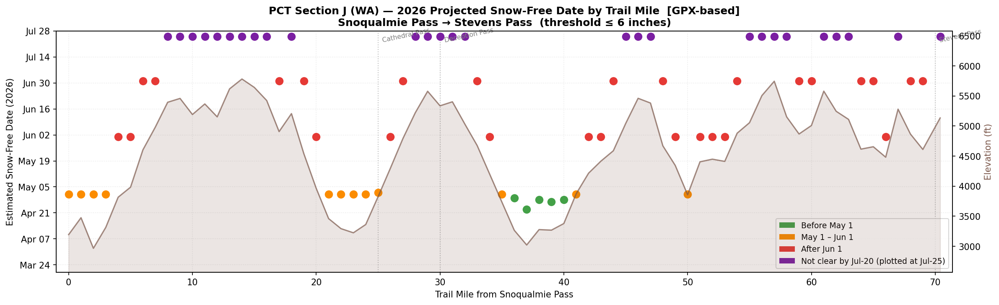
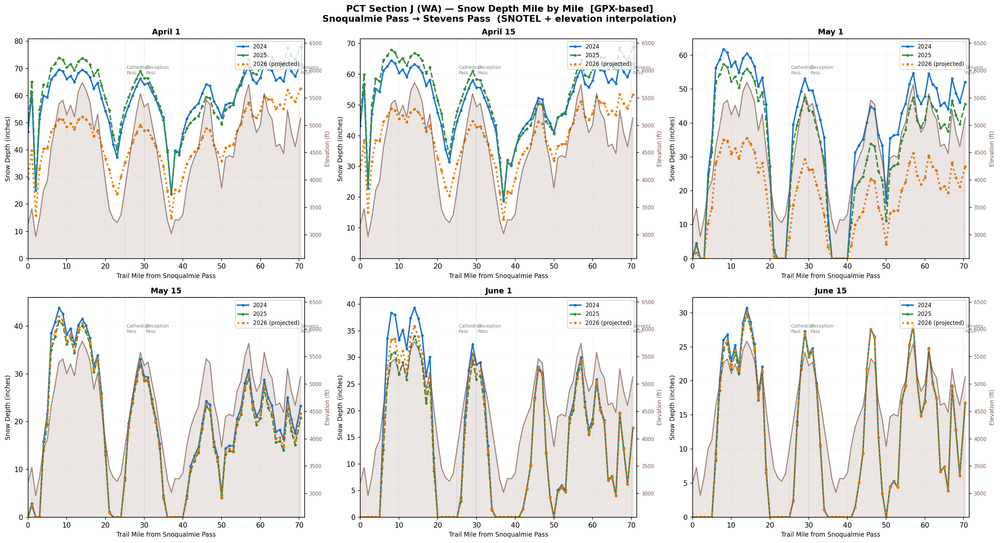
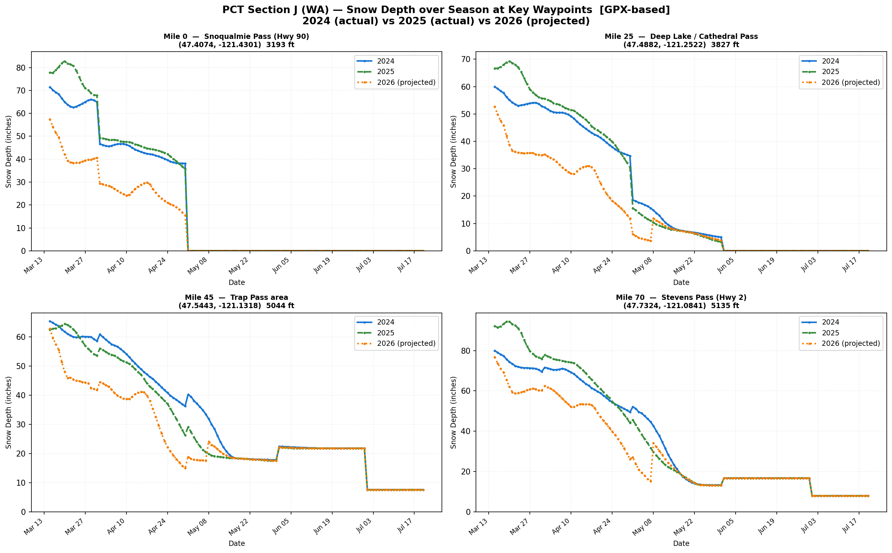

# PCT Section J — Snow Depth Analyzer
### Washington State · Snoqualmie Pass (Hwy 90) → Stevens Pass (Hwy 2) · 70.4 miles

> **For hikers:** Jump straight to the [2026 Snow-Free Date Map](#-2026-snow-free-date-map) below.  
> **For developers:** See [How to Run](#how-to-run) and [Technical Reference](#technical-reference).

*Data current as of May 7, 2026. Re-run the script to refresh.*

---

## What this tool tells you

This tool answers one practical question:

> **"When will each mile of PCT Section J be snow-free in 2026 — and how does this year compare to 2024 and 2025?"**

It pulls real sensor data from up to 20 automated SNOTEL snow stations in the Central Cascades, applies elevation-based math to fill in the gaps between stations, and produces mile-by-mile snow depth estimates and projected snow-free dates for the 70.4-mile stretch from Snoqualmie Pass to Stevens Pass.

---

## 🗓 2026 Snow-Free Date Map

**This is the most useful chart for trip planning.** Each dot is one trail mile. The higher the dot, the later that mile clears.



### How to read this chart

**X-axis (left → right):** Trail mile — Mile 0 is Snoqualmie Pass (Hwy 90), Mile 70 is Stevens Pass (Hwy 2).

**Y-axis (bottom → top):** Projected snow-free date — lower dots clear earlier, higher dots clear later.

**Dot colors:**

| Color | Meaning | What it means for you |
|---|---|---|
| 🟢 Green | Snow-free before May 1 | Easy travel — likely bare ground |
| 🟠 Orange | Snow-free May 1 – June 1 | Some snow, passable for experienced hikers |
| 🔴 Red | Snow-free after June 1 | Significant snow — microspikes likely needed |
| 🟣 Purple | Not clear by July 20 | Deep snow persists — axe/crampons may be needed |

**The brown silhouette** behind the dots is the terrain elevation profile. Notice how the dots match the terrain — valley crossings (the dips in the silhouette around miles 20–22 and 35–39) are orange, while the ridges that spike up to 5,000–5,900 ft are red or purple.

### 2026 summary at a glance (as of May 7, 2026)

| Section | Miles | Elevation | Status |
|---|---|---|---|
| Snoqualmie Pass approach | 0–4 | 3,200–3,800 ft | **Open now** (mi 0–3) · Jun 1 (mi 4) |
| Chikamin / Park Lakes ridges | 7–17 | 5,000–5,900 ft | **Not clear by Jul 20 (purple)** |
| Waptus River valley | 20–24 | 3,200–4,000 ft | **Open now** (mi 21–24) · Jun 1 (mi 20) |
| Cathedral / Deception ridges | 25–32 | 3,800–5,600 ft | **Open now** (mi 25) · Jun 1 → not clear (mi 26–32) |
| Deception Creek valley | 35–40 | 3,000–3,800 ft | **Open now** (all) |
| Surprise Lake to Necklace | 41–53 | 3,900–5,000 ft | **Open now** (mi 41, 50) · Jun 1–Jul 1 → not clear |
| Trap Pass / Hope Lake ridges | 44–47, 54–58 | 5,000–5,700 ft | **Not clear by Jul 20 (purple)** |
| Cady Pass to Lake Valhalla | 59–66 | 4,500–5,600 ft | Jul 1 (mi 59–60, 64–65) · not clear (mi 61–63, 67) |
| Stevens Pass | 70.4 | 5,135 ft | **Not clear by Jul 20 (purple)** |

> **What "not clear by Jul 20" means:** The projections only cover through July 20. These miles likely clear sometime in late July or August in a typical year — but that's outside the model's window.

---

## 📅 Snow Depth on Key Dates

This chart shows the full 70-mile snow depth profile at six specific dates — like six snapshots of the season as it advances.



### How to read this chart

**Each of the 6 panels is a different calendar date** — reading left to right, top to bottom: April 1 → April 15 → May 1 → May 15 → June 1 → June 15.

Within each panel:
- **X-axis:** Trail mile (0 = Snoqualmie, 70 = Stevens Pass)
- **Left Y-axis:** Snow depth in inches
- **Right Y-axis (brown):** Trail elevation in feet
- **Blue solid line:** 2024 actual data
- **Green dashed line:** 2025 actual data
- **Orange dotted line:** 2026 projected (real data through May 7, estimated beyond)
- **Brown filled area:** Terrain elevation — notice how the snow lines peak wherever the terrain peaks

### What the chart shows

**April 1 (top-left):** The entire trail is under 50–75 inches of snow. The dips in the snow curves at miles ~22 and ~36 are valley crossings where the trail drops to ~3,200 ft — snow-free even in April. The peaks at miles ~10–15 and ~28–32 are ridges sitting at 5,000–5,800 ft with 60–75 inches of snow.

**May 1 (top-right):** Valley sections are clearing fast (dipping toward zero). Ridge sections still hold 40–60 inches.

**June 1 (bottom-middle):** Most of the trail below 4,500 ft is clear or nearly clear. High ridges (miles 8–15, 28–32, 44–47, 54–58) still have 25–40 inches.

**June 15 (bottom-right):** Only the highest terrain above ~5,000 ft retains significant snow (15–30 inches).

**2026 vs prior years:** The orange 2026 line sits *below* the 2024 and 2025 lines on early dates, suggesting a somewhat lighter snowpack going into this spring. By June, all three years converge at the high-elevation sections.

---

## 📈 Melt Season Curves at 4 Key Locations

This chart shows how snow melts over the full spring season at four specific spots — from the trailhead to the northern terminus.



### How to read this chart

Each of the 4 panels is a **specific trail location**. The X-axis runs from mid-March to late July. The Y-axis is snow depth in inches. Where the line reaches zero, that location is snow-free.

- **Blue solid:** 2024 (actual)
- **Green dashed:** 2025 (actual)
- **Orange dotted:** 2026 (real through May 7, projected beyond)

### What each location shows

**Mile 0 — Snoqualmie Pass (3,193 ft) — top-left**
Starting at 50–80 inches in March, the snowpack melts steadily and hits zero around **early May**. The 2026 line (orange) begins noticeably lower than 2024 and 2025, consistent with a lighter early-season snowpack. All three years converge at the late-April melt.

**Mile 25 — Cathedral Pass area (3,827 ft) — top-right**
Starts at 50–68 inches. Melts more slowly — clears around **late May to early June**. 2026 appears lighter than prior years here too.

**Mile 45 — Trap Pass area (5,044 ft) — bottom-left**
Starts at 60+ inches. Drops steadily through May and June but **never fully reaches zero by July 17** — settling around 8 inches at the end of the analysis window. This is one of the harder miles to time.

**Mile 70 — Stevens Pass (5,135 ft) — bottom-right**
Starts at 80–100 inches — the snowiest of the four locations. Drops through May and June and stabilizes around **10–15 inches through late July**. Stevens Pass does not clear within the analysis window. 2026 consistently tracks below 2024 and 2025.

> **Key insight from this chart:** Snoqualmie Pass clears in about 7 weeks (March 15 → early May). Stevens Pass takes 18+ weeks and still isn't fully clear by late July.

---

## How to Run

```powershell
cd c:\repos\snowd
pip install numpy pandas requests matplotlib   # first time only
$env:PYTHONIOENCODING="utf-8"
python pct_snow_gpx.py
```

Runtime: ~3–5 minutes (daily data generation + SNOTEL API calls with retry).

Outputs go to `pct_snow\`:

| File | Description |
|---|---|
| `pct_j_snowfree_2026.csv` | The snow-free date table — one row per trail mile |
| `pct_section_j_snow_depth.csv` | Full daily data: every mile × every day × 3 years (~2.3 MB) |
| `snow_pivot_2024/2025/2026.csv` | Spreadsheet-friendly pivot tables per year |
| `gpx_waypoints.csv` | GPS coordinates + elevation for all 71 mile markers |

---

## Technical Reference

### Data sources

| Source | What it provides | Used for |
|---|---|---|
| **NRCS SNOTEL** (`wcc.sc.egov.usda.gov`) | Real sensor readings: snow depth, SWE, temperature at 20 stations | Primary historical data 2024–2026 |
| **NWS API** (`api.weather.gov/gridpoints/SEW/151,53`) | Current snow line elevation near Snoqualmie Pass | Terminal "current conditions" display only |
| **Open-Meteo forecast** (`api.open-meteo.com`) | 16-day snowfall/temperature forecast at Stevens Pass | Terminal forecast display only |

All APIs are free with no API key required.

### Methodology

1. **GPX parsing** — 8,864 trackpoints from `COURSE_334291582.gpx` are interpolated to produce GPS coordinates and elevation at every integer trail mile (71 waypoints total).

2. **SNOTEL discovery** — the AWDB API is queried for all active WA/OR SNOTEL stations within 70 miles of the trail. The 20 closest are used. Calls are chunked to 15 stations per request to avoid URL length limits. Each call uses 3-attempt retry with exponential backoff.

3. **Interpolation** — for each trail mile on each date, snow depth is estimated using **Inverse Distance Weighting** (closer stations have proportionally higher influence) combined with a **seasonal lapse rate** (snow depth increases with elevation at a rate that strengthens through the melt season). A smooth transition zone eliminates the abrupt snow-line cutoff artifacts present in earlier versions.

4. **2026 projection** — real SNOTEL data is used through May 7. Beyond that, a weighted average of 2024 (35%) and 2025 (65%) is used. No trend extrapolation is applied — two years is insufficient.

5. **Snow-free detection** — a mile is declared snow-free when depth drops below **6 inches and stays there for 5 consecutive days**. The 5-day requirement guards against warm spells followed by late-season refreeze.

### Key configuration (top of `pct_snow_gpx.py`)

| Setting | Value | What it controls |
|---|---|---|
| `GPX_FILE` | `c:\repos\snowd\COURSE_334291582.gpx` | Input track |
| `OUTPUT_DIR` | `c:\repos\snowd\pct_snow` | Output folder |
| `MAX_STATIONS` | 20 | SNOTEL stations used in IDW |
| `CHUNK_SIZE` | 15 | Stations per API call |
| `CONSECUTIVE_DAYS` | 5 | Refreeze guard for snow-free detection |
| `SAMPLE_FREQ` | `1D` | Daily sampling |

### Accuracy expectations

| Trail type | Snow depth error | Snow-free date error |
|---|---|---|
| Near SNOTEL stations (miles 0–5, 68–70) | ±5–10 inches | ±3–7 days |
| Valley crossings (miles 20–23, 35–39) | ±8–15 inches | ±5–10 days |
| High ridges above 5,000 ft (miles 8–17, 28–32, 55–58) | ±15–30 inches | ±2–4 weeks |

**What the model cannot account for:** wind drifting (adds depth to north-facing bowls), forest canopy (reduces depth under trees), aspect effects (south-facing slopes melt 2–4 weeks earlier), or any significant weather event after May 7, 2026.

---

## Project Files

```
c:\repos\snowd\
├── README.md                        ← This file
├── pct_snow_gpx.py                  ← Main script (v2)
├── pct_snow_depth.py                ← Legacy script (Rainy Pass→Manning Park)
├── COURSE_334291582.gpx             ← Garmin GPX track (8,864 pts, 70.43 mi)
├── api_probe.py / _probe_api.py     ← API testing utilities
├── guide.txt                        ← API research notes
└── pct_snow\
    ├── gpx_waypoints.csv            ← 71 mile markers: GPS + elevation
    ├── pct_section_j_snow_depth.csv ← Full daily table (~2.3 MB)
    ├── snow_pivot_2024/2025/2026.csv ← Pivot tables for Excel
    ├── pct_j_snowfree_2026.csv      ← Snow-free dates per mile
    ├── pct_j_snow_by_mile.png       ← 6-panel profile chart
    ├── pct_j_snow_over_time.png     ← Melt curves at 4 waypoints
    └── pct_j_snowfree_2026.png      ← Snow-free timeline (this README's main chart)
```

---

*Script: `pct_snow_gpx.py` v2 · Data: NRCS SNOTEL + NWS + Open-Meteo · Generated May 7, 2026*

---

## Understanding the Output Files

### CSVs

| File | Approx. rows | Key columns | Description |
|---|---|---|---|
| `gpx_waypoints.csv` | 71 | mile, lat, lon, elev_ft, name | GPS coordinates and elevation at every trail mile from the GPX track |
| `pct_section_j_snow_depth.csv` | ~330,000 | Year, Date, Mile, Elev_ft, SnowDepth_in, SWE_in | Full tidy table — every mile × every **daily** date × 3 years (~2.3 MB) |
| `snow_pivot_2024.csv` | 71 miles × ~128 dates | mile rows, date columns | Pivot table for 2024 — easy to browse in Excel |
| `snow_pivot_2025.csv` | 71 × ~128 | same | Same for 2025 |
| `snow_pivot_2026.csv` | 71 × ~128 | same | Same for 2026 (real + projected) |
| `pct_j_snowfree_2026.csv` | 71 | Mile, Waypoint, Elev_ft, Est_SnowFree_2026, Consecutive_days_required | One row per trail mile; date when depth stays below threshold for 5+ consecutive days |

> The tidy CSV is large (~2.3 MB) because data is daily. Use the pivot CSVs for quick browsing in Excel.

### Key column meanings

| Column | Unit | Meaning |
|---|---|---|
| `SnowDepth_in` | inches | Estimated depth of snow on the ground (SNWD element) |
| `SWE_in` | inches | Snow Water Equivalent — how much water is in the snowpack |
| `Est_SnowFree_2026` | date string | First date of a 5-consecutive-day run below the 6-inch threshold; `>Jul-20` means not clear before the window ends |
| `Consecutive_days_required` | integer | Always 5 — the refreeze-guard setting used |

---

## Data Sources and APIs

All APIs are **free** and require **no API keys**.

### NRCS AWDB — SNOTEL Sensor Network
**Primary data source for 2024, 2025, and real 2026 data.**

| Property | Value |
|---|---|
| Provider | USDA Natural Resources Conservation Service |
| Station endpoint | `https://wcc.sc.egov.usda.gov/awdbRestApi/services/v1/stations` |
| Data endpoint | `https://wcc.sc.egov.usda.gov/awdbRestApi/services/v1/data` |
| Data type | Snow depth (SNWD), snow water equivalent (WTEQ), max/min temperature (TMAX/TMIN) |
| Discovery | Queries all active WA + OR SNOTEL stations within 70 miles; finds ~226 candidates, uses 20 closest |
| Fetch strategy | Chunked: max 15 stations per HTTP call to avoid URL truncation; 3 years × 2 chunks ≈ 6 API calls |
| Retry | 3 attempts with exponential backoff (2 s, 4 s) on each call |

**Stations used in the May 7, 2026 run (20 closest to trail):**

| Station | Triplet | Elev (ft) | Dist from trail (mi) |
|---|---|---|---|
| Rainy Creek | 764:WA:SNTL | 4,060 | 1.0 |
| Stevens Pass | 791:WA:SNTL | 3,940 | 1.0 |
| Grouse Camp | 1049:WA:SNTL | 4,380 | 1.7 |
| Fish Lake | 21B04:WA:SNOW | 3,380 | 2.2 |
| Fish Lake | 478:WA:SNTL | 3,440 | 2.2 |
| Olallie Meadows | 672:WA:SNTL | 4,010 | 2.4 |
| Tinkham Creek | 899:WA:SNTL | 3,000 | 5.5 |
| Keechelus | 12474000:WA:BOR | 2,520 | 7.2 |
| Mount Gardner | 898:WA:SNTL | 2,930 | 7.3 |
| Mt. Gardner | 21B21:WA:SNOW | 2,910 | 7.4 |
| Tunnel Avenue | 21B08:WA:SNOW | 2,490 | 7.4 |
| Keechelus Reservoir Inflow | 12474500:WA:USGS | 2,440 | 7.4 |
| City Cabin | 21B03:WA:SNOW | 2,550 | 7.5 |
| Meadows Pass | 897:WA:SNTL | 3,230 | 8.8 |
| Cedar R nr Cedar Falls | 12115000:WA:USGS | 1,570 | 9.5 |
| + 5 more within 15 mi | | | |

> Wells Creek (48.92°N, Mt. Baker region) and Cayuse Pass (46.87°N, Mt. Rainier region) were in the v1 seed list and biased IDW for the northern and southern trail ends. Both were removed in v2.

### NWS API — Live Snow Line Elevation
**Terminal display only — not used in depth calculations.**

| Property | Value |
|---|---|
| Endpoint | `https://api.weather.gov/gridpoints/SEW/151,53` |
| Data type | Snow level elevation (meters → feet), updated every 3 hours |
| Coverage | Grid cell SEW/151,53 — single ~2.5 km cell near **Snoqualmie Pass only** |

> **Important:** This gridpoint covers only the southern end of the trail. Do not use the NWS snow-line number to infer conditions at Stevens Pass (70 miles away).

### Open-Meteo Forecast — 16-Day Forward Forecast
**Terminal display only — not used in depth calculations.**

| Property | Value |
|---|---|
| Endpoint | `https://api.open-meteo.com/v1/forecast` |
| Data type | Daily: snowfall_sum (cm), snow_depth_max (cm), temperature max/min (°C) |
| Location | Stevens Pass end of the trail |

### Removed in v2: Open-Meteo ERA5 Archive
v1 made ~42 HTTP calls to the Open-Meteo historical ERA5 archive to fetch gridded snow depth at every 5th trail mile. Those values were **never actually used** in any calculation — the code fetched them but had no code path connecting them to the IDW output. The calls wasted 20–40 seconds with no effect on results. Removed entirely in v2.

---

## How Snow Depth Is Estimated

### Step 1 — Inverse Distance Weighting (IDW)

For each trail mile, a weighted average of all SNOTEL stations within **60 miles** is computed:

$$\text{snow\_depth} = \frac{\sum_{i} w_i \cdot d_i}{\sum_{i} w_i} \qquad w_i = \frac{1}{\max(\text{dist}_i,\ 0.5)^2}$$

Closer stations have much greater influence (weight falls off as the square of distance).

### Step 2 — Seasonal Elevation Lapse Rate

Snow depth increases with elevation, and this effect strengthens during the melt season. v2 uses a month-varying lapse rate:

| Month | Lapse rate (in / 100 ft) | Rationale |
|---|---|---|
| March | 0.6 | Deep, consolidated snowpack — less elevation-sensitive |
| April | 0.8 | Low-elevation melt beginning |
| May | 1.1 | Active melt — gradient steepens |
| June | 1.4 | Melt concentrated at high elevations |
| July | 1.6 | Only ridges retain snow — high sensitivity |

$$\text{adjusted} = \left(\text{station\_depth} + \frac{\Delta\text{elev}}{100} \times \text{lapse}(month)\right) \times \text{snow\_line\_factor}(\text{elev},\ month)$$

### Snow-Line Factor — Smooth Ramp (v2)

Instead of a hard monthly elevation cutoff (which caused step discontinuities in charts), v2 applies a smooth linear ramp across ±400 ft:

| Zone | Factor |
|---|---|
| > snow\_line + 400 ft | 1.0 — full depth |
| snow\_line − 400 ft to + 400 ft | linear 0 → 1 |
| < snow\_line − 400 ft | 0.0 — bare ground assumed |

Monthly snow-line centers: March 2,500 ft · April 3,000 ft · May 3,800 ft · June 4,500 ft · July 5,200 ft

### Step 3 — 2026 Projection

For dates after May 7, 2026, the 2026 value is a weighted average of prior years — no trend extrapolation:

$$v_{2026} = \max(0.65 \times v_{2025} + 0.35 \times v_{2024},\ 0)$$

For dates through May 7, real SNOTEL data is used directly.

---

## Data Accuracy and Limitations

### What is real data vs. estimated

| Type | Status |
|---|---|
| SNOTEL sensor readings 2024 and 2025 | ✅ Physically measured |
| Real 2026 SNOTEL readings through ~May 7 | ✅ Physically measured |
| NWS snow line — current conditions | ✅ Real-time operational model |
| Every value on the actual trail | ⚠️ Interpolated — no sensors on the PCT |
| High-elevation segments (5,000–5,987 ft) | ⚠️ Lapse rate extrapolates above station range (max ~4,380 ft) |
| 2026 dates after May 7 | ⚠️ Projected from 2024/2025 weighted average |

### Expected accuracy by trail segment

| Trail segment | Elevation | Depth error | Snow-free date error |
|---|---|---|---|
| Near stations (miles 0–5, 68–70) | 3,000–5,135 ft | ±5–10 in | ±3–7 days |
| Valley crossings (miles 20–23, 35–39) | 3,000–3,800 ft | ±8–15 in | ±5–10 days |
| High ridges (miles 8–17, 28–32, 55–58) | 5,000–5,900 ft | ±15–30 in | ±2–4 weeks |

### What this tool cannot model

- **Wind loading and drifting** — north-facing bowls can hold 2× the IDW-predicted depth
- **Forest canopy** — tree cover reduces snow accumulation under canopy
- **Aspect effects** — south-facing slopes melt 2–4 weeks earlier than north-facing at the same elevation
- **Extreme weather events** — a significant storm or heat wave after May 7, 2026 will not be captured in projections
- **La Niña / El Niño effects** — 2026 is a La Niña transition year; the weighted average may be optimistic or pessimistic

### Snow-free date interpretation

`Est_SnowFree_2026` is the first date when snow depth stays below **6 inches for 5 consecutive days**. Short warm spells followed by refreeze no longer trigger a false "snow-free" date. If hiking before the listed date, expect snow at that mile. After the listed date, that mile is likely passable without microspikes — but check current conditions before departure.

---

## Full Technical Reference

### Architecture (v2)

```
GPX file (8,864 trackpoints)
        │
        ▼
  parse_gpx()              → 71 mile-marker waypoints (lat/lon/elev_ft)
        │
        ▼
  discover_stations()      → 20 closest SNOTEL stations from AWDB API
        │
        ├── fetch_snwd_chunked()    × 3 years  → {triplet: {SNWD/WTEQ/TMAX/TMIN: pd.Series}}
        │   (15 stations/chunk, 3× retry with backoff)
        ├── fetch_nws_snow_level()             → [{validTime, snow_level_ft}]
        └── fetch_open_meteo_forecast()        → {time, snowfall_sum, ...}
                │
                ▼
        estimate_snow()  ← IDW + seasonal elev_adjust() + snow_line_factor()
                │           (daily dates, max_dist_mi = 60)
                ▼
  df_hist: 2024 + 2025 daily tidy DataFrame
  hist_index: O(1) dict for 2026 projection lookups
                │
                ▼
  df_26: real SNOTEL data + 0.65×v25 + 0.35×v24 weighted average
                │
        ┌───────┴────────────┐
        ▼                    ▼
  Snow-free dates        3 PNG charts + 6 CSV files
  (5-day consecutive
   streak required)
```

### Key functions

| Function | Purpose |
|---|---|
| `api_get(url, ...)` | GET with 3-attempt exponential backoff retry (2 s, 4 s delays) |
| `parse_gpx(gpx_path)` | Parses GPX, cumulative haversine distance, linear interpolation at mile markers |
| `discover_stations(waypoints)` | Queries AWDB for WA+OR SNOTEL within 70 mi; deduplicates; returns 20 closest |
| `fetch_snwd_chunked(stations, yr)` | Chunked AWDB calls (15 stations/chunk) for SNWD/WTEQ/TMAX/TMIN |
| `fetch_nws_snow_level()` | NWS gridpoint snow level; meters → feet |
| `fetch_open_meteo_forecast(lat, lon)` | 16-day daily forecast at one coordinate |
| `snow_line_factor(elev_ft, month)` | Smooth 0→1 ramp across ±400 ft transition zone around monthly snow line |
| `elev_adjust(snwd_in, st_elev, tgt_elev, month)` | Applies seasonal lapse rate + snow_line_factor |
| `estimate_snow(wp, dt, snotel_data, stations)` | IDW with boolean-mask windowing (pandas 3.0 compatible) |
| `haversine_mi(lat1, lon1, lat2, lon2)` | Great-circle distance in miles |
| `date_range_for_year(yr)` | Daily Timestamps Mar 15 → Jul 20 |

### Python environment (verified working)

```
Python 3.14
numpy      2.4.4
pandas     3.0.2
matplotlib 3.10.8
requests   2.33.1
```

---

## Full Configuration Reference

All tunable constants near the top of `pct_snow_gpx.py` (lines 42–72):

| Constant | Default | Effect |
|---|---|---|
| `GPX_FILE` | `c:\repos\snowd\COURSE_334291582.gpx` | Path to your GPX track |
| `OUTPUT_DIR` | `c:\repos\snowd\pct_snow` | Where charts and CSVs are saved |
| `MAX_STATIONS` | `20` | Max SNOTEL stations used in IDW |
| `CHUNK_SIZE` | `15` | Max station triplets per AWDB HTTP call (prevents URL truncation) |
| `FETCH_START_MD` | `(3, 15)` | Analysis start: March 15 |
| `FETCH_END_MD` | `(7, 20)` | Analysis end: July 20 |
| `SAMPLE_FREQ` | `"1D"` | Daily sampling (was `"7D"` in v1) |
| `CONSECUTIVE_DAYS` | `5` | Consecutive days below threshold to declare snow-free |
| `LAPSE_BY_MONTH` | `{3:0.6, 4:0.8, 5:1.1, 6:1.4, 7:1.6}` | Seasonal lapse rates (in / 100 ft) |
| `ELEV_SNOW_LINE_BY_MONTH` | `{3:2500, 4:3000, 5:3800, 6:4500, 7:5200}` | Monthly snow-line center elevations (ft) |
| `SNOW_LINE_TRANSITION_FT` | `400` | ±ft ramp width around snow line center |
| `NWS_GRIDPOINT` | `SEW/151,53` | NWS grid cell (Snoqualmie Pass area only) |

> To analyze a different trail: replace `GPX_FILE`, update `NWS_GRIDPOINT` to the appropriate WFO and grid cell, and review `SEED_STATIONS` for that region.

---

## Changes from v1

### Bug fixes

| Issue | v1 behavior | v2 fix |
|---|---|---|
| GPX path wrong | `c:\snow\pct_snow\COURSE_334291582.gpx` — file didn't exist there | `c:\repos\snowd\COURSE_334291582.gpx` |
| pandas 3.0 incompatibility | `yr_data.loc[window]` raised `KeyError` when window timestamps weren't exact index labels | Boolean mask: `yr_data[mask]` |
| Chart 2 x-axis misaligned | Integer `range(len(sub))` — curves shifted if any year had missing dates | Real `pd.Timestamp` normalized to a common reference year |
| Chart 1 landmark text position | `ax.get_ylim()[1] * 0.9` called before `tight_layout()` — incorrect y position | `ax.get_xaxis_transform()` with `y=0.88` in axes coordinates |

### Data quality improvements

| Issue | v1 | v2 fix |
|---|---|---|
| Wrong seed stations | Wells Creek (48.92°N, ~90 mi north) and Cayuse Pass (46.87°N, ~50 mi south) biased IDW | Both removed |
| URL truncation risk | All 30 stations in a single GET — could silently truncate | Chunked: max 15 stations per call |
| No API retries | Single-attempt HTTP — any timeout/5xx silently returned `nan` | `api_get()` retries 3× with exponential backoff |
| Dead network calls (~42 HTTP) | Open-Meteo ERA5 archive fetched but results never used | Removed entirely |

### Methodology improvements

| Aspect | v1 | v2 |
|---|---|---|
| Date sampling | Weekly (`7D`) — ±3.5 day error on snow-free dates | Daily (`1D`) — ±1 day precision |
| Lapse rate | Fixed `1.0 in/100 ft` year-round | Seasonal: `{3:0.6, 4:0.8, 5:1.1, 6:1.4, 7:1.6}` |
| Snow-line transition | Hard cliff — step discontinuities in profiles | Smooth ±400 ft linear ramp (`snow_line_factor()`) |
| IDW max distance | 90 miles — included Rainier/Baker stations | 60 miles — stays within Central Cascades |
| 2026 projection formula | `v25 + (v25-v24) × 0.5` — trend extrapolation, no basis | `0.65 × v25 + 0.35 × v24` — weighted average only |
| 2026 projection lookup | O(n²) DataFrame mask scans in the projection loop | O(1) pre-built `hist_index` dictionary |
| Snow-free detection | First single reading ≤ 6 in | First **5 consecutive days** ≤ 6 in (refreeze guard) |

### Chart improvements

| Chart | Issue | v2 fix |
|---|---|---|
| Chart 3 (snow-free timeline) | "after Jun 1" and "not cleared by Jul-20" both red — indistinguishable | "not cleared by Jul-20" → purple (`#7B1FA2`) |
| NWS snow line printout | No caveat about gridpoint scope | Added `[Snoqualmie Pass area; single NWS grid cell]` note |

---

## Trail Landmarks Reference

| Mile | Landmark | Elevation (ft) | Typical clearance (normal year) |
|---|---|---|---|
| 0 | Snoqualmie Pass (Hwy 90) | 3,193 | April–early May |
| 5 | Gold Lake Bog area | ~3,983 | May |
| 10 | Chikamin Peak area | ~5,192 | Late June–July |
| 15 | Park Lakes Basin | ~5,643 | July+ |
| 20 | Waptus River | ~3,963 | Early May |
| 25 | Deep Lake / Cathedral Pass | ~3,827 | May |
| 30 | Deception Pass | ~5,337 | Late June–July |
| 35 | Deception Creek | ~3,734 | May |
| 40 | Surprise Lake Junction | ~3,378 | Early May |
| 45 | Trap Pass area | ~5,044 | Late June–July |
| 50 | Necklace Valley Jct | ~3,857 | May |
| 55 | Hope Lake / Mig Lake | ~5,056 | Late June–July |
| 60 | Cady Pass | ~5,009 | Late June–July |
| 65 | Lake Valhalla area | ~4,656 | June–July |
| 70 | Stevens Pass (Hwy 2) | 5,135 | Late June–July |

---

*Script: `pct_snow_gpx.py` v2 · Data: NRCS SNOTEL + NWS + Open-Meteo · Generated May 7, 2026*
